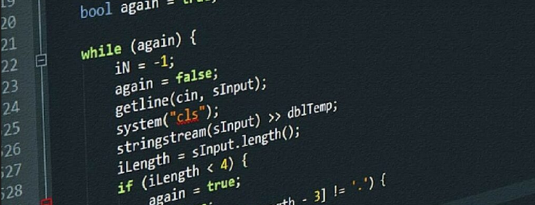
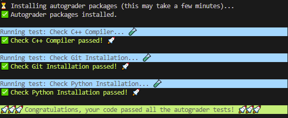

# Assignment 0: Setup!

Due Friday, January 17th at 11:59PM

## Overview

Welcome to CS106L! This assignment will get you setup for the rest of the quarter so that setup for the rest of the assignments is simple and smooth. By the end of this assignment, you should be able to compile and run C++ files from VSCode and run the autograder, which you'll be doing for each of the remaining assignments!

If you run into any issues during setup, please reach out to us on [EdStem](https://edstem.org/us/courses/72089/discussion) or come to our office hours!

## Part 1: Installing Python

### Part 1.1: Checking for an existing Python installation

The autograder for each assignment in CS106L uses Python. You must have a Python installation of version `3.8` or higher. To check your Python version you can run the following in your terminal:

If you're on Linux or Mac:

```sh
python3 --version
```

If you're on Windows:

```sh
python --version
```

If you get a version that is `3.8` or higher, then you're good, **you can continue to Part 2**. Otherwise, please follow Part 1.2 to install Python on your machine.

### Part 1.2: Installing Python (if you don't already have it installed)

#### Mac & Windows

Please download the latest Python version [here](https://www.python.org/downloads/) and run the installer. **Note: on Windows, you must check `Add python.exe to PATH` in the installer**. After installing, verify that the installation worked by following the steps in **Part 1.1**.

#### Linux

These instructions are for Debian-based distributions, like Ubuntu. Tested on Ubuntu 20.04 LTS.

1. Update the Ubuntu package lists by running

    ```sh
    sudo apt-get update
    ```

2. Install Python:

    ```sh
    sudo apt-get install python3 python3-venv
    ```

3. Restart your terminal and verify that the installation worked by running:

    ```sh
    python3 --version
    ```

## Part 2: Setup VSCode and C++ Compiler

We will use VSCode to write C++ code for this class. Below are instructions to setup VSCode along with the GCC compiler for your machine.

### Mac

#### Step One: Installing VSCode

Go to [this link](https://code.visualstudio.com/docs/setup/mac)
and download Visual Studio Code for Mac. Follow the instructions on this webpage under the
section **Installation**.

Inside VSCode, head to the extensions tab </img> and search for **C/C++**. Click on the **C/C++** extension, and then click **Install**.

Finally, open the command palette (<kbd>Cmd+Shift+P</kbd>), search for `Shell Command: Install 'code' command in PATH`, and select it. This will allow you to launch VSCode directly from the terminal by running the `code` command.

**🥳 At this point you should successfully have VSCode on your Mac 👏**

#### Step Two: Installing a C++ Compiler

1. Check if you have Homebrew by running 

    ```sh
    brew --version
    ```

   If you get something like

   ```sh
    brew --version
    Homebrew 4.2.21
   ```

   then skip ahead to step 3. If you get anything else that looks suspicious, proceed to step 2!

2. Run this command:

    ```sh
    /bin/bash -c "$(curl -fsSL https://raw.githubusercontent.com/Homebrew/install/HEAD/install.sh)"
    ```

    which will download Homebrew🍺, a package manager for Mac. Woot woot.

3. Run the following command:

    ```sh
    brew install gcc
    ```

    which will install the GCC compiler on your machine.

4. Make note of which GCC version Homebrew installs. In most cases, this will be `g++-14`. 
    By default, the `g++` command on Mac is an alias to the built-in `clang` compiler. We can fix this by running 
    
    ```sh
    echo 'alias g++="g++-14"' >> ~/.zshrc
    ```
    
    to make `g++` point to the version of GCC we just installed. Change `g++-14` in the above command to whichever version of GCC was installed.

5. Restart your terminal and verify that everything worked by running the following command:

    ```sh
    g++ --version
    ```

### Windows

#### Step One: Installing VSCode

Go to [this link](https://code.visualstudio.com/docs/setup/windows)
and download Visual Studio Code for Windows. Follow the instructions on this webpage under the
section **Installation**.

Inside VSCode, head to the extensions tab </img> and search for **C/C++**. Click on the **C/C++** extension, and then click **Install**.

**🥳 At this point you should successfully have VSCode on your PC 👏**

#### Step Two: Installing a C++ Compiler

1. Follow the instructions at [this link](https://code.visualstudio.com/docs/cpp/config-mingw) under the section **Installing the MinGW-w64 toolchain.**

2. After fully following the instructions under **Installing the MinGW-w64 toolchain** you should now be able to verify everything worked by running the following command:

    ```sh
    g++ --version
    ```

### Linux

These instructions are for Debian-based distributions, like Ubuntu. Tested on Ubuntu 20.04 LTS.

#### Step One: Installing VSCode

Go to [this link](https://code.visualstudio.com/docs/setup/linux)
and download Visual Studio Code for Linux. Follow the instructions on this webpage under the section **Installation**.

Inside VSCode, head to the extensions tab </img> and search for **C/C++**. Click on the **C/C++** extension, and then click **Install**.

Finally, open the command palette (<kbd>Ctrl+Shift+P</kbd>), search for `Shell Command: Install 'code' command in PATH`, and select it. This will allow you to launch VSCode directly from the terminal by running the `code` command.

**🥳 At this point you should successfully have VSCode on your Linux machine 👏**

#### Step Two: Installing a C++ Compiler

1. In a terminal, update the Ubuntu package lists by running

    ```sh
    sudo apt-get update
    ```

2. Next install the `g++` compiler: 

    ```sh
    sudo apt-get install g++-10
    ```

3. By default, the system version of `g++` will be used. To change it to the version you just installed, you can configure Linux to use G++ version 10 or a higher version installed like so: 

    ```sh
    sudo update-alternatives --install /usr/bin/g++ g++ /usr/bin/g++-10 10
    ```

4. Restart your terminal and verify that GCC was installed correctly. You must have a `g++` version of 10 or higher: 

    ```sh
    g++ --version
    ```

## Part 3: Cloning the class code via Git!

Git is a popular VCS (version control system) that we will use to distribute starter codes for the assignments. Make sure that you have Git installed by running

```sh
git --version
```

If you see anything that looks off, [download and install Git from this page](https://git-scm.com/downloads)!

### Download the starter code

Open VSCode, and then open a terminal (hit <kbd>Ctrl+\`</kbd> or go to **Terminal > New Terminal** at the top of the window) and run the following command:

```sh
git clone https://github.com/cs106l/cs106l-assignments.git
```

which will download the starter code into a folder `cs106l-assignments`. 

### Opening a VSCode workspace

When working on assignments in this class, we recommend you open up a VSCode workspace for the specific assignment folder you are working on. So if you now have a folder `cs106l-assignments`, you can first `cd` (change directory) into the correct folder:

```sh
cd cs106l-assignments/assign0
```

which changes your working directory to `assign0`, and then you can open up a VSCode workspace dedicated to this folder:

```sh
code .
```

and now you should be ready to go!

### Fetching assignments

As we update existing assignments and release new ones, we will push updates to this repository. To fetch a new assignment, open up a terminal to your `cs106l-assignments` directory and run

```sh
git pull origin main
```

You should now have the latest starter code!

# Part 4: Testing your setup!

Now we will have you compile your first C++ file and run the autograder. To run any C++ code, first you'll need to compile it. Open up a VSCode terminal (again, hit <kbd>Ctrl+\`</kbd> or go to **Terminal > New Terminal** at the top of the window). Then make sure that you are in the `assign0/` directory and run:

```sh
g++ -std=c++20 main.cpp -o main
```

This **compiles** the C++ file `main.cpp` into an executable file called `main` which contains raw machine code that your processor can execute. Assuming that your code compiles without any errors, you can now do:

```sh
./main
```

which will actually run the `main` function in `main.cpp`. This will execute your code and then run an autograder that will check that your installation is correct.

> [!NOTE]
>
> ### Note for Windows
>
> On Windows, you may need to compile your code using
>
> ```sh
> g++ -static-libstdc++ -std=c++20 main.cpp -o main
> ```
>
> in order to see output. Also, the output executable may be called `main.exe`, in which case you'll run your code with:
>
> ```sh
> ./main.exe
> ```
> 

> [!NOTE]
>
> ### Note for Mac
>
> You may get a compiler error when attempting to compile this code due to a missing `wchar.h` (or some similar file). If this happens, you may need to reinstall the Xcode command line tools on your machine by running the following commands:
>
> ```sh
> sudo rm -rf /Library/Developer/CommandLineTools
> sudo xcode-select --install
> ```
>
> Afterwards, you should be able to compile normally.

# 🚀 Submission Instructions

After compiling and running, if your autograder looks like this:



then you have finished the assignment! Woot woot. To submit the assignment, please complete the feedback form [at this link](https://forms.gle/QNedgpAXdVHipZgYA)!
