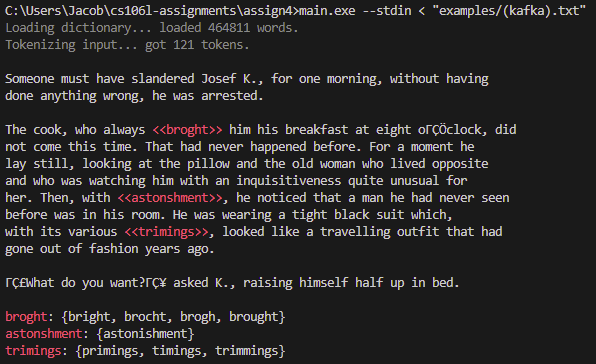
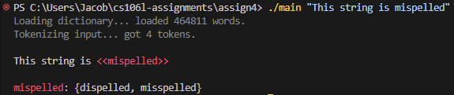

<p align="center">
  
</p>


# Assignment 4: Ispell

Due Tuesday, February 18th at 11:59PM

## Overview

Now that we've spent some time discussing the core components of the STL—containers, iterators, functors, and algorithms—and the key ingredient that powers it all—templates—let's put it all together! 
In this assignment, you will write the core logic for [Ispell](https://en.wikipedia.org/wiki/Ispell), an old Unix style spell checker that does a simple spellcheck. To do so, you will write some
code that makes use of the `<algorithm>` header and the new C++ ranges library.

All of your code will go into `spellcheck.cpp`. Once you are done, you will have a spell checker that looks like this:

<p align="center">
  
</p>

> [!IMPORTANT]  
> This assignment handout may look long, but there is actually not a lot of code that you need to write for this assignment! We have included a lot of extra details to make implementing this assignment (hopefully) more straightforward. Please let us know if anything confuses you (feel free to reach out on Ed/lecture/OH)! 

To download the starter code for this assignment, please see the instructions for [**Getting Started**](../README.md#getting-started) on the course assignments repository.

## Running your code

To run your code, first you'll need to compile it. Open up a terminal (if you are using VSCode, hit <kbd>Ctrl+\`</kbd> or go to **Terminal > New Terminal** at the top). Then make sure that you are in the `assign4/` directory and run:

```sh
g++ -std=c++20 main.cpp spellcheck.cpp -o main
```

Assuming that your code compiles without any compiler errors, you can now do:

```sh
./main
```

which will actually run the `main` function in `main.cpp`.

As you are following the instructions below, we recommend intermittently compiling/testing with the autograder as a way to make sure you're on the right track!

> [!NOTE]
>
> ### Note for Windows
>
> On Windows, you may need to compile your code using
>
> ```sh
> g++ -static-libstdc++ -std=c++20 main.cpp spellcheck.cpp -o main
> ```
>
> in order to see output. Also, the output executable may be called `main.exe`, in which case you'll run your code with:
>
> ```sh
> ./main.exe
> ```

## Building Ispell

The classic Unix program Ispell works as follows. First, a dictionary is loaded into memory containing all of the common English words. A word is misspelled if it can't be found in the dictionary. Suggestions for each misspelled word are found using the [Damerau-Levenshtein distance](https://en.wikipedia.org/wiki/Damerau%E2%80%93Levenshtein_distance) algorithm, which tells you approximately how many edits (additions, deletions or replacements of a single letter, or swapping two adjacent letters) must be done to change one word into the other. If the Damerau-Levenshtein distance is exactly one between the misspelled word and one of the dictionary words, then it is added to the list of suggestions. The idea here is that when one misspells a word, usually they are only off by one small change (for example, consider "mispelled" vs. "misspelled").

In this assignment, we have given you all the infrastructure to build this spellchecker, including implementations of the Damerau-Levenshtein function. Your job will be to implement the core of the algorithm that spellchecks words. Specifically, you will write an algorithm that splits an input string into a set of tokens (`tokenize`), and another algorithm that actually identifies misspelled words given a (tokenized) input string and a dictionary (`spellcheck`). To add a bit of an extra challenge (and to make this relevant to the last week's lectures), there's a catch: you can't use any for/while loops in your code. You must implement these tasks entirely using the STL: `tokenize` using the traditional STL algorithms, and `spellcheck` using the brand new ranges library. In the process, you will get exposure to how we can manipulate modern data structures in C++ using algorithms and lambda functions.

This may sound like a lot, but don't worry! This handout will walk you through each of the algorithms in detail.

### `tokenize`

```cpp
struct Token { std::string content; size_t src_offset; };
using Corpus = std::set<Token>;
Corpus tokenize(const std::string& input);
```

The `tokenize` method will take an input string and split it up into a set of `Token` objects. Take a look at the `Token` struct we've defined in `spellcheck.h`. A `Token` represents a single piece of content within a larger file: conceptually, it is just a single word appearing in a broader text; in code, it is a `std::string` apppearing somewhere in a file at index `src_offset`. Our goal is to split up an input file into a set of `Token`s, which we refer to as a `Corpus` (a `Corpus` is just a type-alias for an `std::set<Token>`).

A key constraint for this problem is as follows: tokens are surrounded by whitespace and/or the boundaries of the input file. For example, the short string `"history will absolve me"` consists of four tokens: 

* `{ content: "history", src_offset: 0 }`
* `{ content: "will", src_offset: 8 }`
* `{ content: "absolve", src_offset: 13 }`
* `{ content: "me", src_offset: 21 }`

To implement `tokenize`, we will use the traditional STL methods like `std::transform`, without any for/while loops. Our high level strategy to do this will be to:

1. Identify all iterators to space characters
2. Generate tokens between consecutive space characters
3. Get rid of empty tokens

Here's a step-by-step guide you can follow to accomplish this:

1. **Step One: Identify all iterators to space characters**  
    If we can get all iterators in the string pointing to whitespace characters, then we can more-or-less think of the tokens present in the string as the characters between any two whitespace characters. We almost want to call `find_if` multiple times to collect all of iterators to whitespace characters. Fortunately, we have provided you with a method to do just that, `find_all`.

    > 📄 [**`find_all`**](./utils.cpp)
    > ```cpp
    > template <typename Iterator, typename UnaryPred>
    > std::vector<Iterator> find_all(Iterator begin, Iterator end, UnaryPred pred);
    > ```
    >
    > Returns a vector of all the iterators between `begin` and `end` whose element matches the unary predicate `pred`. **This vector also includes the boundary iterators, `begin` and `end`**. In other words, if `it` is an iterator in the returned vector, then either `pred(*it)` or `it == begin` or `it == end`. The iterators in the vector are guaranteed to be in order.

    We can get a vector of all the iterators to whitespace character by calling `find_all` on our `source` string and passing in a unary predicate that checks if a character is whitespace. Thankfully, such a function comes built-in with C++: it is called `isspace`.

    > 📄 [**`isspace`**](https://en.cppreference.com/w/c/string/byte)  
    > When passing `isspace` to `find_all`, we must pass it as `isspace` and not `std::isspace`. This is because there are actually multiple versions of the `isspace` method:
    >
    > ```cpp
    > int isspace(int ch);                          // Defined in header <cctype> and <ctype.h>
    >
    > template <class CharT>
    > bool isspace(CharT ch, const locale& loc);    // Defined in header <locale>
    > ```
    >
    > Technically, the first version is defined both [as part of the `namespace std`](https://en.cppreference.com/w/cpp/header/cctype) and [as a free-floating function inherited from C](https://en.cppreference.com/w/c/string/byte) (and not in any particular namespace). The second version is part of `std` and defined in the `<locale>` header. Writing `isspace` by itself refers to the C version, whereas `std::isspace` refers to both of the above functions and so the compiler has a hard time inferring the `UnaryPred` type parameter.
    >
    > Sometimes you will see people write `::isspace`: this just tells C++ to look in the *global namespace* (not inside `std`) for `isspace`, and accomplishes the same thing.

2. **Step Two: Generate tokens between consecutive space characters**  
    Now that we have all of the iterators to space characters, we can consider a token as any range of characters between two consecutive iterators to space characters. To see why, consider this diagram:

    ```
    "history will absolve me"
     ▲      ▲    ▲       ▲  ▲
     ├──────┼────┼───────┼──┤
     │  t1  │ t2 │   t3  │t4│
    ```

    The arrows represent the iterators returned by `find_all`, and as you can see, the tokens are the characters between any two arrows. Don't worry about whether or not the iterator actually does point to whitespace (you don't need to worry about "trimming" the tokens)—`Token` has a constructor that takes in a pair of iterators and automatically handles trimming whitespace around the edges.

    > 📄 [**`Token`**](./spellcheck.cpp)
    > ```cpp
    > template <typename It>
    > Token(const std::string& source, It begin, It end);
    > ```
    >
    > Given a `source` string and a pair of iterators `begin` and `end` identifying the extents of a token inside `source`, constructs a `token`. Automatically handles trimming extra whitespace and punctuation characters at the edges of the token.

    We need to somehow call this constructor for each pair of consecutive iterators. To do this, we will use [overload (3) of `std::transform`](https://en.cppreference.com/w/cpp/algorithm/transform).

    > 📄 [**`std::transform`**](https://en.cppreference.com/w/cpp/algorithm/transform)
    > ```cpp
    > template <class InputIt1, class InputIt2, class OutputIt, class BinaryOp>
    > OutputIt std::transform(InputIt1 first1, InputIt1 last1, InputIt2 first2,
    >                         OutputIt d_first, BinaryOp binary_op);
    > ```
    > 
    > Given two equally-sized ranges, one starting at `first1` and the other starting at `first2` (such that end iterator of the first range is `last1`), applies a binary function `binary_op` to each pair of iterators from the two ranges (e.g. `binary_op(first1, first2)`, `binary_op(first1 + 1, first2 + 1)`, etc.) and stores the result to the output range (of the same size) starting at `d_first`. 
    
    For our `binary_op`, we can provide a lambda function that takes in two `std::string::const_iterator`s (you might choose to use `auto` parameters for this lambda, as discussed in lecture) `it1` and `it2`, and constructs the `Token` using the aforementioned `Token { source, it1, it2 }` constructor. Note that we must pass `source` to this constructor, so you will need to capture it in the lambda function you create!

    For the output range (`d_first`), we will first create a `std::set<Token>` to store the tokens that we find. Suppose we call that set `tokens`. Then, we can create an [`std::inserter(tokens, tokens.end())`](https://en.cppreference.com/w/cpp/iterator/inserter) to store the resulting tokens to.

    > 📄 [**`std::inserter`**](https://en.cppreference.com/w/cpp/iterator/inserter)
    > ```cpp
    > template <class Container>
    > std::insert_iterator<Container> inserter(Container& c, typename Container::iterator i);
    > ```
    >
    > An output iterator that inserts any value written to it into the container `c` at position `i` (where `i` is of the container's iterator type). The return value is an [`std::insert_iterator<Container>`](https://en.cppreference.com/w/cpp/iterator/insert_iterator) which can be passed as the output range to other STL algorithms (for example, `std::transform`).
    >
    > Note that `std::inserter` returns an iterator that is a bit different than other iterator types we have seen, but it is still an output iterator! Other algorithms can dereference it and write to it, and internally it inserts elements into the underlying container.

    For the input ranges (`first1`, `last1`, and `first2`), we will need to be a bit clever in our choice of iterators. We must choose iterators such that the `binary_op(first1, first2)` constructs the first token in the container, `binary_op(first1 + 1, first2 + 1)` constructs the second token in the container, etc. How can we manipulate these parameters such that we apply `binary_op` to consecutive pairs of whitespace iterators? Remember, `tokens.begin()` is the first iterator of the container, `tokens.begin() + 1` is the second iterator, etc. **Hint: there is nothing preventing the range given by `first1` from overlapping with the range given by `first2`!**

3. **Step Three: Get rid of empty tokens**  
    Some of the tokens we've produced so far will be empty (for example, what if there were multiple consecutive whitespace characters in our string). We will need to remove these tokens. Luckily, there is a [`std::erase_if` function](https://en.cppreference.com/w/cpp/container/set/erase_if) that can remove elements from a `std::set` which match some condition.

    > 📄 [**`std::erase_if`**](https://en.cppreference.com/w/cpp/container/set/erase_if)
    > ```cpp
    > template <class Key, class Compare, class Alloc, class Pred>
    > std::set<Key, Compare, Alloc>::size_type erase_if (std::set<Key, Compare, Alloc>& c, Pred pred);
    > ```

    For `pred`, we can pass a lambda function which checks if a token is empty. For example, if `token` is a `Token`, we could check `token.content.empty()`.

    Finally, you can return `tokens`, which contains all of the valid tokens in the input string.

Once you've finished this step, your spellcheck should start reporting token counts. If you compile your code, you can run:

```sh
./main "hello wrld"
```

to spellcheck the string `"hello wrld"`. It should report:

```
Loading dictionary... loaded 464811 words.
Tokenizing input... got 2 tokens.
```

Your tokenize method has tokenized an English dictionary of about a half-million words, as well as the input string, `"hello wrld"`, in lightning speed. However, it's not quite yet spell-checking: `"wrld"` is reported as correctly spelled. To fix this, we will need to implement the `spellcheck` function.

### `spellcheck`

```cpp
struct Mispelling { Token token; std::set<std::string> suggestions; };
using Dictionary = std::unordered_set<std::string>;
std::set<Mispelling> spellcheck(const Corpus& source, const Dictionary& dictionary);
```

The `spellcheck` method takes in a tokenized `Corpus` (this is the output of your `tokenize` method) and a `Dictionary` (which is just an `std::unordered_set<std::string>` represent all the valid English words), and returns a set of `Mispelling` structs. Each `Mispelling` struct identifies a misspelled `token` and a set of suggested words that `token` could be replaced with to spell the word properly.

> [!NOTE]
> **Addendum:** After releasing this assignment, we realized that the name `Mispelling` is itself actually misspelled. Ah... the irony.

To identify mispellings, we will run the following algorithm. This time, we get some practice using the new ranges/views library in the `std::ranges::views` namespace:

1. Skip words that are already correctly spelled.
2. Otherwise, find one-edit-away words in the dictionary using Damerau-Levenshtein.
3. Drop misspellings with no suggestions.

Here's a step-by-step guide to implement this algorithm:

1. **Step One: Skip words that are already correctly spelled.**  
    We'll know that a word is spelled correctly if it appears in `dictionary`: for example `dictionary.contains("world")` would return `true` whereas `dictionary.contains("wrld")` would return `false`. Our first step is to skip over words in `source` that have already been correctly spelled. To do this, we can use the `std::ranges::views::filter` view.

    > 📄 [**`std::ranges::views::filter`**](https://en.cppreference.com/w/cpp/ranges/filter_view)  
    > ```cpp
    > template <ranges::viewable_range R, class Pred>
    > constexpr ranges::view auto filter(R&& r, Pred&& pred);
    >
    > template <class Pred>
    > constexpr /* range adaptor closure */ filter(Pred&& pred);
    > ```
    >
    > `filter(r, pred)` yields a view that adapts an underlying range `r` such that, when iterating over the resulting view, only elements which satisfy `pred` are included. `filter(pred)` creates a *range adaptor* which can be applied to a range by chaining it with `operator|`, as shown below.

    When setting up an `std::ranges::views` pipeline, we chain together ranges in a series of steps. Each step *adapts* the previous step, lazily applying an operation (such as filtering out or transforming elements) via a lambda function. If you look at the above definition of `std::ranges::views::filter`, you'll see that there are two ways of doing this:

    ```cpp
    auto view = std::ranges::views::filter(source, /* A lambda function predicate */);

    /* ...is the same as... */

    auto view = source | std::ranges::views::filter(/* A lambda function predicate */);
    ```

    The second version is an arguably cleaner syntax, because it allows us to chain more than one step together in the pipeline using `operator|` without creating separate variables for each step. Notice that `std::ranges::views::filter` is a bit tedious to spell out, so people will often shorten this by creating a *namespace alias* like so:

    ```cpp
    namespace rv = std::ranges::views;
    auto view = source | rv::filter(/* A lambda function predicate */);
    ```

    The autograder will accept either version, using `rv::filter` with a namespace alias or `std::ranges::views::filter`.

    Your job in this step is to replace `/* A lambda function predicate */` with a lambda function that takes in a `Token` and returns `true` if that token's content is spelled **incorrectly** (we are only interested in misspelled words). To do this, you will need to make reference to `dictionary` inside of the lambda function, and so you will have to capture it. Should you capture it by reference or value?

2. **Step Two: Find one-edit-away words in the dictionary using Damerau-Levenshtein**  
    At this point, `view` represents a view over all the tokens in `source` that are *incorrectly spelled*. Now, we will transform each of these misspelled tokens into a corresponding `Mispelling` object (and generate suggestions in the process) using the `std::ranges::views::transform` view. 

    >  📄 [**`std::ranges::views::transform`**](https://en.cppreference.com/w/cpp/ranges/transform_view)  
    > ```cpp
    > template <ranges::viewable_range R, class F>
    > constexpr ranges::view auto transform(R&& r, F&& func);
    > 
    > template <class F>
    > constexpr /*range adaptor closure*/ transform(F&& func); 
    > ```
    >
    > `transform(r, func)` yields a view that adapts an underlying range `r` such that, when iterating over the resulting view, each element `e` in `r` is transformed into a new element by applying `func(e)`. `transform(pred)` creates a *range adaptor* which can be applied to a range by chaining it with `operator|`.

    If we combine this step with the previous one, our code will look something like this:

    ```cpp
    namespace rv = std::ranges::views;
    auto view = source 
        | rv::filter(/* A lambda function predicate */)
        | rv::transform(/* A lambda function taking a Token -> Mispelling */);
    ```
    <sup>Note: this is just one approach: your solution may look different if you choose to use the `transform(r, func)` overload or if you don't use a `namespace rv` alias.</sup>
    
    What should we put for `/* A lambda function taking a Token -> Mispelling */`? We should replace it with a lambda function that takes in a `Token` object and produces a `Mispelling` object that contains all of the suggested alternate spellings for `token`. To identify suggestions, we will search through `dictionary` for all the words whose Damerau-Levenshtein distance to `token.content` is exactly `1`. To find the Damerau-Levenshtein distance, you can use the provided `levenshtein` function.

    > 📄 [**`levenshtein`**](./spellcheck.h)  
    > ```cpp
    > size_t levenshtein(const std::string& a, const std::string& b);
    > ```
    >
    > Returns the Damerau-Levenshtein distance between `a` and `b`. Roughly speaking, this represents the number of modifications that must be performed to `a` in order to arrive at `b`. In reality, this function implements a highly optimized version of the Damerau-Levenshtein distance that will early exit if at any point the computed distance would be greater than `1`. 

    Note that going through `dictionary` and finding suggestions should happen for *each* misspelled word. **That means that you will need to nest another `std::ranges::views::filter` call inside the `/* A lambda function taking a Token -> Mispelling */`.** To construct the `std::set` of suggestions, you will need to materialize the nested view of suggested words into a set, triggering the lazy evaluation, using [overload (4) of the `std::set` constructor](https://en.cppreference.com/w/cpp/container/set/set).

    > 📄 [**`std::set`**](https://en.cppreference.com/w/cpp/ranges/transform_view)  
    > ```cpp
    > template <class InputIt>
    > set(InputIt first, InputIt last, const Compare& comp = Compare(), const Allocator& alloc = Allocator());
    > ```
    >
    > Creates a `set` from a range of elements between two iterators, `first` and `last`.

    For example, the following code could be used to materialize a view into a set:

    ```cpp
    auto view = dictionary | rv::filter(/* A lambda function predicate */);
    std::set<std::string> suggestions(view.begin(), view.end());
    ```

    Lastly, to create a `Mispelling` object from a `token` and a set of `suggestions`, we can use uniform initialization:

    ```cpp
    Mispelling { token, suggestions }
    ```

    This should be the return value of the `/* A lambda function taking a Token -> Mispelling */` lambda function in the code above.

3. **Step Three: Drop misspellings with no suggestions.**  
    At this point, `view` contains all of our misspelled words with their suggestions: it is a view over a collection of `Mispelling` objects. However, some of these `Mispelling` objects won't have any suggestions. For example, the gibberish word `"adskadnfknfs"` is definitely misspelled, but there's no word in the English dictionary that is one edit away from it. We would like to remove these suggestion-less mispellings from our view before returning them.

    Once again, we can apply `std::ranges::views::filter` to `view`. You should have all the information you need to do this! After you filter the empty mispellings, you'll want to materialize `view` into an `std::set<Mispelling>` and return it, which you can do through similar process described for `suggestions` in Part Two above!

    > ⚠️ [**`std::ranges::to`**](https://en.cppreference.com/w/cpp/ranges/to)  
    > You might remember that we used `std::ranges::to` in lecture to materialize a view of `char` into an `std::string`:
    > ```cpp
    > auto v = s | rv::filter(isalpha)
    >            | /* Some other steps */
    >            | std::ranges::to<std::string>();
    > ```
    > You might be tempted to do something similar here with `std::ranges::to<std::set<Mispelling>>()`. This is a good idea! But the `std::ranges::to` method was only recently introduced in C++23. Depending on the version of compiler you are using, this code may compile or it may not! To be safe, and to make sure that your code compiles when we run it through the autograder on our end, please use the `std::set<Mispelling>` constructor with iterators. **In general, please only use C++ features up through C++20 for this assignment.**

If you have implemented everything correctly up to this point, you should have a fully functioning spellchecker! To test it out, try re-compiling and running:

```sh
./main "This string is mispelled"
```

and you should see output like this:

<p align="center">
  
</p>

You can also spellcheck one of the given examples:

```sh
./main --stdin < "examples/(marquez).txt"
```

> [!NOTE]  
> **PowerShell Users:**  
> If you are using Microsoft PowerShell (Windows), the syntax to spellcheck an example will look a little bit different:
> ```sh
> Get-Content "examples/(marquez).txt" | ./main --stdin
> ```

> [!NOTE]  
> We encourage you to play around with the spellcheck program and see what interesting behaviours you find. Here is the full list of options you can try:
> 
> ```
> ./main [--dict dict_path] [--stdin] [--unstyled] [--profile] text
> 
> --dict dict_path  Sets the location of the dictionary. Defaults to words.txt
> --stdin           Read from stdin. You can use this to pipe input from a file
> --unstyled        Don't add any color to the output!
> --profile         Profile the code, printing out how long tokenizing/spellcheck took
> text              The text you want to spellcheck, if not using stdin
> ```
> 
> If you are looking for an added challenge, try running your code with the `--profile` option. Our spellchecking algorithm, despite using a simple brute
> force approach that searches through the entire dictionary of about half a million words, still runs quite quickly! Feel free to look into ways you can
> improve the performance of this algorithm (while still having correct output)! This is completely optional, but we would love to see what you come up with.


## 🚀 Submission Instructions

To fully test your spellchecker, try re-compiling and running the autograder:

```sh
./main
```

If you pass all tests, you are ready to submit! Before you submit the assignment, please fill out this [short feedback form](https://forms.gle/TkYjcRTbRzQAGGoZ9). **Completion of the form is required to receive credit for the assignment.** After filling out the form, please upload the files to Paperless under the correct assignment heading.

Your deliverable should be:

* `spellcheck.cpp`

You may resubmit as many times as you'd like before the deadline.


